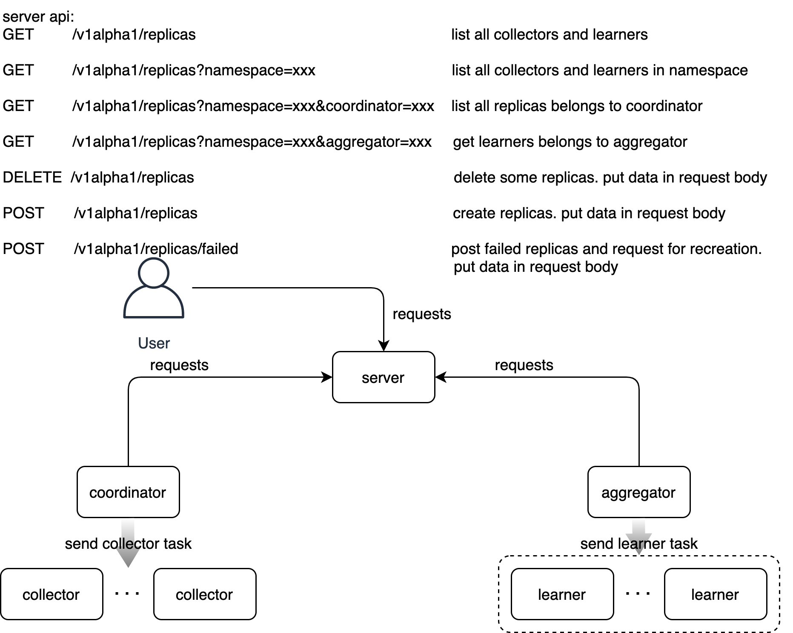

# DI Orchestrator架构
DI-engine框架分为3个重要的模块，分别是coordinator、collector和learner。一般情况下，一个DI-engine训练任务只有一个coordinator，learner和collector的数目可以变化。三个模块的作用分别为：
- coordinator：保持与collector和learner的连接，接受collector和learner的获取原信息请求、推送原信息请求等，向learner和collector发送任务。
- collector：从coordinator获取RL模型在存储中间件中的位置并加载RL模型，然后在自身构造的环境中根据RL模型决策产生数据帧，将数据帧存储回存储中间件，并将数据帧原信息（存储路径、大小等）汇报给coordinator。
- learner：从coordinator获取数据帧存储位置并从存储中间件中加载数据帧开始训练RL模型，训练完成之后将模型存储到中间件中，并将模型原信息（存储路径、大小等）汇报给coordinator。由于learner部分常常存在数据并行训练这一额外的分布式机制，避免混淆，我们将与coordinator进行交互的模块称作logic learner，是coordinator下发任务的基本单位；而将数据并行训练中的单个learner进程称作ddp learner，多个ddp learner进程提供数据并行服务。一个logic learner可以对应1个ddp learner（单卡）或多个ddp learner（多卡）。另外，提供数据并行训练服务还需要额外引入aggregator模块，aggregator负责将多个ddp learner的训练结果进行汇总并发送给coordinator，即aggregator与多个ddp learner一起构成logic learner，而coordinator只会与logic learner进行交互。

有关DI-engine的详细介绍可参考[DI-engine developer tutorial](https://opendilab.github.io/DI-engine/tutorial_dev/index.html)。

为了提供DI-engine在Kubernetes（K8s）中运行的支持，我们设计了DI Orchestrator，本文将说明利用DI Orchestrator，DI-engine各个模块在K8s系统上如何被创建、如何相互发现、如何开始训练等。DI Orchestrator的架构如下图所示：


整体分为两大模块：`di-server`和`di-operator`，`DDPL`指ddp learner，`Lm`指Learner，`Cn`指Collector，`Aggregator+DDPL`构成一个logic learner。接下来将首先介绍一个DI-engine任务提交到K8s之后DI Orchestrator如何将DI-engine的各个模块（在K8s中就是一个[pod](https://kubernetes.io/docs/concepts/workloads/pods/)）创建并启动，然后将对di-server和di-operator进行介绍。

## 任务创建流程
这里介绍任务创建流程，说明一个DI-engine任务在K8s中从创建到执行完成的一整个生命周期
- 编写AggregatorConfig yaml文件，定义aggregator的模板，将在后面创建DIJob的时候用来创建aggregator，aggregator可以为训练端提供数据并行训练服务。
- 编写DIJob yaml文件，定义coordinator、collector、learner的模板，提交到K8s集群中。
- di-operator监听到DIJob的提交，创建coordinator，并为coordinator创建可访问的域名。
- coordinator启动之后按照默认配置向di-server请求创建一定数目的collector和learner。
- di-server收到coordinator的创建请求后，读取DIJob中collector和learner的模板，创建相应数目的collector（上图中Cn）和learner（上图中Lm）并把collector和learner可访问的URL返回给请求方。同时，根据每个learner中申请的GPU数目来决定是否创建aggregator。即当learner申请的GPU数目大于1时创建为该learner创建一个aggregator，否则不创建aggregator。
- coordinator等待collector, learner（aggregator和其多个ddp learner可以看作一个logic learner）连接上后开始下发任务开始训练。
- 用户可手动向di-server发送请求增删collector和learner，coordinator会定期查询其可用的collector和learner数目并决定新建或断开连接。
- 训练结束后，di-operator默认会将collectors、learner、aggregator都删除掉，而coordinator则会保留给用户查看日志等操作。

## DI Operator
di-operator是在一个负责在K8s系统中编排DIJob的组件，采用K8s [operator pattern](https://kubernetes.io/docs/concepts/extend-kubernetes/operator/)，通过[controller pattern](https://kubernetes.io/docs/concepts/architecture/controller/)中的控制循环监听K8s集群中DIJob的状态，并在有需要的时候对DIJob的状态进行修改，使得DIJob的实际状态与我们预定义的状态尽可能保持一致。

### API定义
根据DI框架中每个模块的特性，我们定义了两种自定义资源（Custom Resource），分别是DIJob和AggregatorConfig。前者用来定义一个RL任务的coordinator、collector和learner运行所需的必备条件，包括镜像、启动命令、所需计算和存储资源、环境变量等；后者用来定义一个RL任务的aggregator运行所需的必备条件。

DIJob定义：
```go
type DIJobSpec struct {
	// Group is a collection of DIJobs
	Group string `json:"group,omitempty"`

	//Priority labels the priority of DIJob
	PriorityClassName PriorityClassName `json:"priorityClassName,omitempty"`

	// CleanPodPolicy defines the policy to clean pods after DIJob completed
	CleanPodPolicy CleanPodPolicy `json:"cleanPodPolicy,omitempty"`

	// Volumes defines the shared volumes for DI-engine components
	Volumes []corev1.Volume `json:"volumes,omitempty"`

	Coordinator CoordinatorSpec `json:"coordinator"`

	Collector CollectorSpec `json:"collector,"`

	Learner LearnerSpec `json:"learner,"`
}
```

AggregatorConfig定义：
```go
type AggregatorConfigSpec struct {
	Aggregator AggregatorSpec `json:"aggregator,"`
}
```

> **为什么aggregator单独定义？**
    aggregator对所有使用DI-engine框架进行RL训练的任务都是通用的，因此我们将aggregator定义为一个全局的、共享的资源AggregatorConfig，所有RL任务提交后，di-server将通过读取集群中唯一的AggregatorConfig来创建aggregator。另外，aggregator只是针对最常见的数据并行训练，如果是其他并行训练方法，需要定义新的Custom Resource。
### 状态定义
用户提交DIJob后，di-operator便接管了DIJob的生命周期的管理，为了便于用户了解DIJob的状态，我们定义了以下阶段（phase）：

```go
const (
	// JobCreated means the job has been submitted to the cluster,
	// but not all the pods and services have been created,
	// or no pods are running
	JobCreated Phase = "Created"

	// JobRunning means all the pods are in running state
	JobRunning Phase = "Running"

	// JobSucceeded means job completed without error
	JobSucceeded Phase = "Succeeded"

	// JobFailed means some pods failed, job is also considered failed
	JobFailed Phase = "Failed"

	// JobUnknown means the job is in unknown state
	JobUnknown Phase = "Unknown"
)
```
一个正常运行并结束的DIJob会经历Created、Running和Succeeded三个阶段：
- 当DIJob提交后，di-operator将coordinator创建后进入Created阶段
- 当coordinator pod处于Running阶段后DIJob进入Running阶段
- 当coordinator pod处于Completed阶段后DIJob进入Succeeded阶段。
另外，当coordinator pod处于Failed阶段时，DIJob也会进入Failed阶段。而aggregator、collector、learner在失败后会立即重启，不会影响DIJob所处的阶段。

Unknown阶段暂时未作定义。

### 控制循环
使用[kubebuilder v3](https://github.com/kubernetes-sigs/kubebuilder/releases/download/v3.0.0/kubebuilder_linux_amd64)构建项目，operator所需的[reflector、informer、indexer](https://github.com/kubernetes/sample-controller/blob/master/docs/controller-client-go.md)、controller等组件都由[controller-runtime](https://github.com/kubernetes-sigs/controller-runtime)封装到[manager](https://github.com/kubernetes-sigs/controller-runtime/blob/master/pkg/manager/manager.go)中，将调谐（Reconcile）函数暴露给我们实现调谐逻辑，如下代码所示：
```go
func (r *DIJobReconciler) Reconcile(ctx context.Context, req ctrl.Request) (ctrl.Result, error) {
    // your reconcile logic here
    return ctrl.Result{}, nil
}
```

当用户提交DIJob后，informer获取到该提交事件后触发handler，之后Reconcile函数被调用；Reconcile函数中调用list pod方法发现coordinator未创建，则读取DIJob中关于coordinator的定义模板，创建相应的coordinator pod（coordinator程序在其中运行）和service（用于pod间通信），并将一些环境变量写入pod中，包括pod的名称、pod的命名空间、访问coordinator的URL等环境变量。

其中，DI-engine框架的每个模块占用的端口都有一个默认值，如下所示：

```go
DefaultCollectorPort   = 22270
DefaultLearnerPort     = 22271
DefaultAggregatorPort  = 22272
DefaultCoordinatorPort = 22273
```

coordinator创建之后，di-operator将监听pod的状态并修改DIJob的状态。等到DIJob完成后（Succeeded或者Failed），di-operator默认会将DIJob的所有处于Running阶段的pod和所有的service都删除，coordinator pod会保留。

### Webhook
用户提交DIJob时，可能存在yaml文件里的某些字段输入错误的问题，导致DIJob的运行状态达不到预期，影响用户排查问题；或者需要为DIJob的某些字段设置默认值。如果在DIJob提交到K8s集群前能为DIJob设置默认值，以及做一次正确性校验，有助于用户提前发现问题。

在K8s中，可以配置webhook在DIJob提交到K8s集群之前对其进行正确性校验。K8s webhook分为MutatingWebhook和ValidatingWebhook，前者用于修改K8s资源对象的值，后者用于验证K8s资源对象的正确性。

di-operator中实现了webhook校验方法，创建MutatingWebhook用于设置DIJob的默认值；创建ValidatingWebhook用于校验DIJob的正确性。比如对`CleanPodPolicy`字段，我们在MutatingWebhook中设置其默认值为`Running`，表示DIJob完成后将Running的pod都删除；我们在ValidatingWebhook中校验`CleanPodPolicy`字段的值，如果用户设置的值不等于`None`、`ALL`、`Running`中的任何一个，则拒绝提交该DIJob。

## DI Server
di-server是一个为DI-engine框架定制的http服务器，提供新增、删除和查询collector、learner、aggregator的功能。通过调用di-server的相关接口，di-server为DIJob提供了动态增删collector和learner的能力。下面将对di-server的设计进行简要介绍，包括存储AggregatorConfig、DIJob以及DIJob所有pod的本地cache；用于动态新增、删除和查询collector、learner和aggregator的http接口设计。

### 本地cache
为了减少di-server与K8s api server之间查询的频率，从而减轻K8s api server的负担，我们利用[client-go](https://github.com/kubernetes/client-go)提供的informer机制将AggregatorConfig、DIJob和DIJob的所有pod存储在本地cache，如下图所示

[示意图](https://github.com/kubernetes/sample-controller/blob/master/docs/controller-client-go.md)


上图中我们只关注上半部分：reflector通过list & watch接受到新的资源实例存在的通知，就将新资源实例放到Delta Fifo queue中，informer从Delta Fifo queue中获取新资源实例并通过indexer存放到本地cache中。查询操作都可以通过查询本地cache来完成，减少向K8s api server的请求次数。如下命令：
```go
genericInformer.Informer().GetIndexer().GetByKey(key)
```

当资源对象有变更时，reflector同样会接受到通知并更新本地cache；另外，informer也会定期向api server同步本地cache，与K8s集群中的资源对象保持一致。


### http接口
为了支持DIJob动态增删collector/learner的需求，di-server提供http接口用于对collector/learner进行新增、删除和查询的功能，如下图所示：



提供如下接口：

| method  |  path |  description |
|---|---|---|
| GET  | /v1alpha1/replicas  |  list all collectors and learners |
| GET  | /v1alpha1/replicas?namespace=xxx  | list all collectors and learners in namespace  |
| GET  | /v1alpha1/replicas?namespace=xxx&coordinator=xxx  | list all replicas belongs to coordinator  |
| GET  | /v1alpha1/replicas?namespace=xxx&aggregator=xxx  | get learners belongs to aggregator  |
| DELETE  | /v1alpha1/replicas  | delete some replicas. put data in request body  |
| POST  | /v1alpha1/replicas  | create replicas. put data in request body  |
| POST  | /v1alpha1/replicas/failed  | post failed replicas and request for recreation. put data in request body  |


## DI Orchestrator的优势
DI Orchestrator为DI-engine框架提供了分布式场景下基于K8s的容器运行方案。对于用户提交的DIJob，di-operator负责对DI-engine的各个模块进行编排，使得各个模块可以正常运行并执行训练任务。通过调用di-server的接口，赋予coordinator新增、删除和查询其所有的collector、learner和aggregator的功能，提升DI-engine框架资源动态分配的能力。总结DI Orchestrator提供了以下优势：
1. 封装性。依赖di-operator的编排能力，部署DI-engine分布式RL训练的细节（包括pod创建、服务发现）对用户来说是透明的。根据DI-engine框架对分布式RL训练的部署需求，di-operator会将coordinator创建出来，然后coordinator再请求di-server创建其他模块，di-operator会把每个模块的pod的状态记录到DIJob的状态中。DIJob的生命周期也由di-operator维护，向用户展示DIJob在不同阶段的状态。
2. 易用性。用户只需要在DIJob的yaml文件中定义好coordinator、collector、learner的配置之后，一键提交到K8s集群即可，di-operator将负责完成部署工作，将用户从K8s集群中复杂的分布式RL训练部署中解放出来。
3. 鲁棒性。依赖K8s的pod重启机制，保证pod在意外退出的情况下能自动重启，coordinator能够迅速响应并重新连接。
4. 动态扩展。DIJob所需的collector/learner/aggregator是动态变化的，因此di-server提供了http接口可以动态调整collector/learner的数目，使得DIJob可以根据自身需求调整collector和learner的比例，优化吞吐量。
