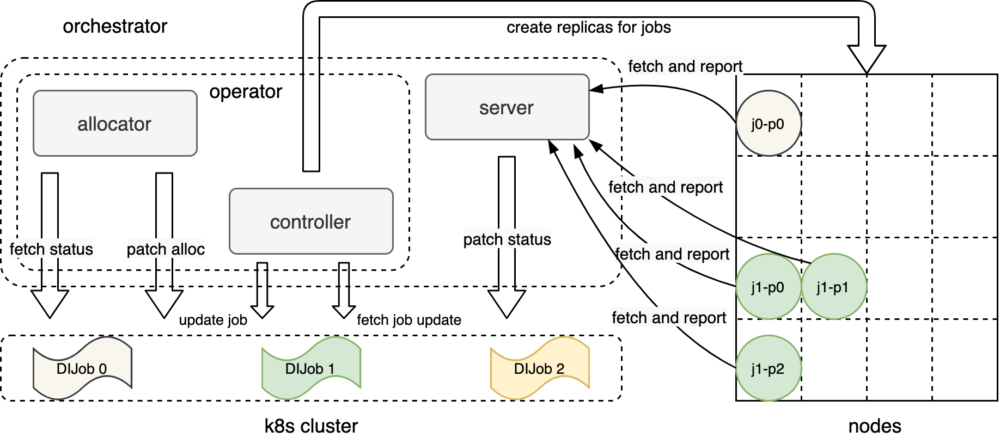
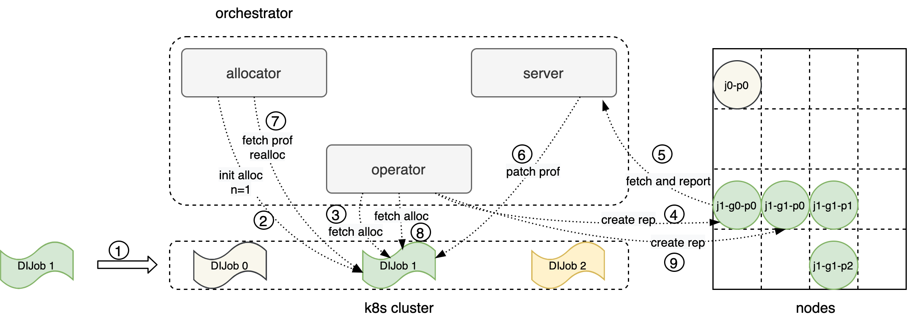

# DI Orchestrator架构

DI-engine框架v1版本分为3个重要的模块，分别是coordinator、collector和learner。对应DI Orchestrator v1版本。

DI-engine框架v2版本将各个模块进行了整合，使得在同一个worker内可以完成完整的训练过程，当有新的worker加入时也能直接加入而无需重启。本文将针对DI-engine v2版本对DI Orchestrator v2版本进行详细描述。

有关DI-engine的详细介绍可参考[DI-engine developer tutorial](https://opendilab.github.io/DI-engine/tutorial_dev/index.html)。

为了提供DI-engine在Kubernetes（K8s）中运行的支持，我们设计了DI Orchestrator，本文将说明利用DI Orchestrator，DI-engine的组件在K8s系统上如何被创建、如何相互发现、如何开始训练等。DI Orchestrator的架构如下图所示：



整体分为两大模块：`di-server`和 `di-operator`。本文将对这两大模块逐一进行介绍。

## DI Operator

di-operator是负责在K8s系统中编排DIJob，采用K8s [operator pattern](https://kubernetes.io/docs/concepts/extend-kubernetes/operator/)，通过[controller pattern](https://kubernetes.io/docs/concepts/architecture/controller/)中的控制循环监听K8s集群中DIJob的状态，并在有DIJob状态变更事件的时候对DIJob进行调谐，使得DIJob的实际状态与预期的状态尽可能保持一致。

### API定义

根据DI-engine框架的特性，我们利用K8s Custom Resource定义了DIJob资源，用来定义一个RL任务运行所期望达成的状态，包括镜像、启动命令、挂载存储、workers数目等。

DIJobSpec中各字段定义及含义：

```go
type DIJobSpec struct {
	// Group is a collection of DIJobs.
	Group string `json:"group,omitempty"`

	// Priority labels the priority of DIJob.
	Priority Priority `json:"priority,omitempty"`

	// EngineFields defines features of the DI-engine framework.
	EngineFields EngineFields `json:"engineFields,omitempty"`

	// CleanPodPolicy defines the policy to clean pods after DIJob completed.
	CleanPodPolicy CleanPodPolicy `json:"cleanPodPolicy,omitempty"`

	// Preemptible defines whether the dijob can be preempted.
	Preemptible bool `json:"preemptible,omitempty"`

	// MinReplicas defines the minimum number of replicas of DIJob.
	MinReplicas int32 `json:"minReplicas,omitempty"`

	// MaxReplicas defines the maximum number of replicas of DIJob.
	MaxReplicas int32 `json:"maxReplicas,omitempty"`

	// Template defines the pod template for DIJob.
	Template corev1.PodTemplateSpec `json:"template"`
}

type EngineFields struct {
	// Topology defines the topology among the workers of the job.
	Topology Topology `json:"topology,omitempty"`

	// ParallelWorkers defines the number of parallel workers in each worker.
	ParallelWorkers int32 `json:"parallelWorkers,omitempty"`
}
```

### 状态定义

用户提交DIJob后，di-operator便接管了DIJob的生命周期的管理，我们定义了以下阶段（phase）便于用户了解DIJob的状态：

```go
const (
	// JobPending means the job has been submitted to the cluster,
	// but not all the pods and services have been created
	JobPending Phase = "Pending"

	// JobStarted means the job has been created and waits for running.
	JobStarting Phase = "Starting"

	// JobRestarting means the job has been rescheduled and waits for restarting.
	JobRestarting Phase = "Restarting"

	// JobRunning means all the pods are in running state
	JobRunning Phase = "Running"

	// JobSucceeded means job completed without error
	JobSucceeded Phase = "Succeeded"

	// JobFailed means some pods failed, job is also considered failed
	JobFailed Phase = "Failed"

	// JobUnknown means the job is in unknown state
	JobUnknown Phase = "Unknown"
)
```

一个正常运行并结束的DIJob会经历Pending、Starting、Running和Succeeded三个阶段，状态转移图如下图所示：


- 当DIJob提交后，进入Pending阶段。
- 当di-operator将workers创建后，进入Starting状态。
- 当所有workers都ready后，进入Running状态。
- 当所有workers都Succeeded后，进入Succeeded状态。
- 当有worker出现Failed，进入Failed状态。
- 当DIJob被重调度或者workers数目与预期不符，进入Restarting状态。

Unknown阶段暂时未作定义。

### 控制循环
借鉴自[Adaptdl](https://github.com/petuum/adaptdl)，v2版本架构对Operator调谐逻辑进行了重构，将调度和调谐逻辑分别在Allocator和Controller中完成，使得组件分工更明确。
#### Allocator控制循环
Allocator为v2架构中新增的模块，用于调度DIJob，包括分配workers和放置workers。定义两个方法（allocate和allocateAll）用于对单任务和多任务进行调度。为了提供不同的调度策略，我们将调度策略定义为一个interface Policy，该interface中定义了两个方法分别是`Allocate`和`Optimize`，前者用于在任务提交时为该任务进行初始调度；后者用于对全局任务进行统一调度。
Policy interface定义如下：

```go
type Policy interface {
	Allocate(job JobInfo, nodes map[string]*NodeInfo) (NodeList, error)
	Optimize(jobs map[string]JobInfo, nodes map[string]*NodeInfo, prevAllocations map[string]NodeList) (map[string]NodeList, error)
}
```
用户可根据自身需求实现自己的调度算法。

当`job.spec.preemptible==false`时，Allocator将不会对该任务进行调度，只会根据`job.spec.minReplicas`为该任务分配固定数目的workers，分配结果写到`job.status.replicas`。不过，用户可以通过修改`job.status.replicas`来变更该任务的workers数目。
> Note：不能直接通过`kubectl apply`或者`kubectl edit`命令直接修改`job.status.replicas`，因为`job.status`被定义为SubResource，对于DIJob的所有的PUT和POST请求都会忽略`job.status`字段。见[Kubernetes API Conversion](https://github.com/kubernetes/community/blob/master/contributors/devel/sig-architecture/api-conventions.md#spec-and-status)
#### Controller控制循环
Controller控制循环用于调谐DIJob的状态，包括生命周期管理、workers的创建和删除等，如前文所述状态转移图。

## DI Server

Server是一个为DI-engine框架定制的http服务器，提供新增、删除和查询workers的功能。Server利用[gin](https://github.com/gin-gonic/gin) web框架提供http服务能力

下面将对Server的设计进行简要介绍，包括用于动态新增、删除和查询workers的http接口以及用户汇报训练任务profilings数据的接口。

### http接口

为了支持DIJob动态增删workers，Server提供http接口用于对workers进行新增、删除和查询，提供如下接口：

| method | path                                             | description                                                               |
| ------ | ------------------------------------------------ | ------------------------------------------------------------------------- |
| GET    | /v2alpha1/[job_id]/replicas                               | get job replicas                                          |
| DELETE | /v2alpha1/[job_id]/replicas                               | delete some replicas. put data in request body                            |
| POST   | /v2alpha1/[job_id]/replicas                               | create replicas. put data in request body                                 |
| POST   | /v2alpha1/[job_id]/profilings                       | post job profiling data. put data in request body |

job_id由`namespace.name.generation`三元组构成。
- create和delete请求：Request Body="{"replicas": n}"，Server读取Request Body中的replicas，直接修改`job.status.replicas`，真正的创建和删除操作由Operator完成。（注：Server只会对preemptible的DIJob进行操作）
- get请求：Server查询DIJob的replicas，并将访问每个replicas的[ip:port]返回。
- Post profilings请求：Request Body="{"data": {}}"，Server读取Request Body中的data，将data patch到`job.status.profilings`中。

## 任务运行流程

用户提交的任务按照以下流程在集群中运行，由Allocator进行调度、Controller进行容器编排、Server进行任务profilings的汇报。

## DI Orchestrator的优势

DI Orchestrator为DI-engine框架提供了分布式场景下基于K8s的容器运行方案。对于用户提交的DIJob，Operator负责对DI-engine的各个模块进行编排，使得各个模块可以正常运行并执行训练任务；通过子模块Allocator为DI-engine框架提供资源动态分配与调度的能力。通过调用Server的接口，赋予用户新增、删除和查询任务的workers的功能。总结DI Orchestrator提供了以下优势：

1. 封装性。依赖Operator的编排能力，部署DI-engine分布式RL训练的细节（包括pod创建、服务发现）对用户来说是透明的。根据DI-engine框架对分布式RL训练的部署需求，Operator为任务创建workers，Operator会把每个worker的状态记录到DIJob的状态中。DIJob的生命周期也由Operator维护，向用户展示DIJob在不同阶段的状态。
2. 易用性。用户只需要在DIJob的yaml文件中定义好任务的配置之后，一键提交到K8s集群即可，Operator将负责完成部署工作，将用户从K8s集群中复杂的分布式RL训练部署中解放出来。同时可以借助命令行工具一键提交DIJob。
3. 鲁棒性。依赖Operator的重启机制，保证workers在意外退出的情况下能自动重启。
4. 动态扩展。DIJob所需的workers是动态变化的，因此Server提供了http接口可以动态调整workers的数目，使得DIJob可以根据自身需求调整workers数目，优化吞吐量。
5. 动态调度。依赖Operator子组件Allocator，针对DI-engine任务进行动态调度变得简单。Allocator提供了针对单任务和多任务的调度策略，可以在不影响正常训练的情况下优化全局任务完成时间。
