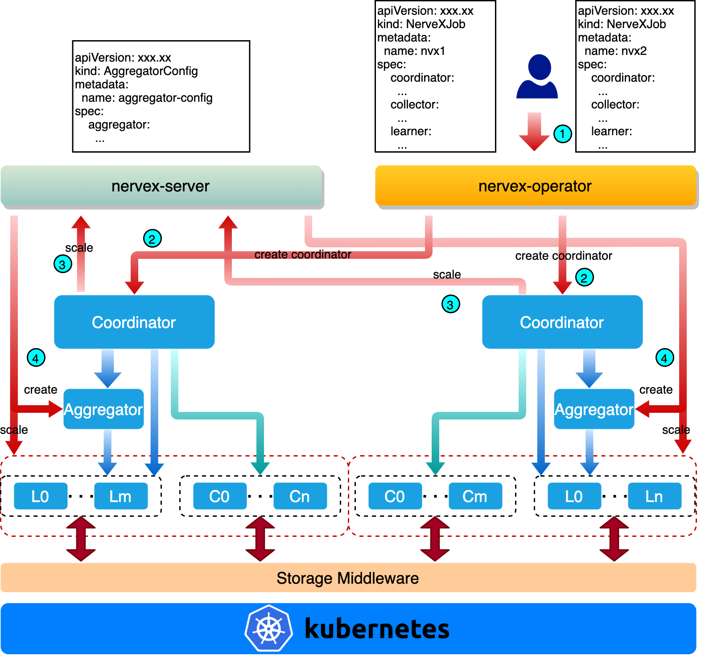

# nerveX-k8s架构
这里将介绍nerveX on k8s的架构，说明nerveX各个模块在k8s系统上如何被创建、如何相互发现、如何开始训练等。有关nerveX的介绍可参考[nerveX key concepts](https://gitlab.bj.sensetime.com/open-XLab/cell/nerveX/tree/doc/one-week/nervex/docs/source/key_concept)。nerveX-k8s的架构如下图所示：


整体分为两大模块：`nervex-server`和`nervex-operator`。接下来将首先介绍一个nerveX任务提交到k8s之后nervex-k8s如何将nerveX的各个模块（在k8s中就是一个[pod](https://kubernetes.io/docs/concepts/workloads/pods/)）创建并启动，然后将对nervex-server和nervex-operator进行介绍。

## 任务创建流程
这里介绍任务创建流程，说明一个nerveX任务在k8s中从创建到执行完成的一整个生命周期
- 编写AggregatorConfig yaml文件，定义Aggregator的模板，该模板将在后面创建NerveXJob的时候用来创建aggregator。
- 编写NerveXJob yaml文件，定义coordinator、collector、learner的模板，提交到k8s集群中。
- nervex-operator监听到NerveXJob的提交，创建coordinator，并为coordinator创建可访问的域名。
- coordinator启动之后按照默认配置向nervex-server请求创建一定数目的collector和learner。
- nervex-server收到coordinator的创建请求后，读取NerveXJob中collector和learner的模板，创建相应数目的collector（上图中Cn）和learner（上图中Lm）并把collector和learner可访问的URL返回给请求方。同时，根据每个learner中申请的GPU数目来决定是否创建aggregator。即当learner申请的GPU数目大于1时创建为该learner创建一个aggregator，否则不创建aggregator。
- coordinator等待collector、learner和aggregator连接上后开始下发任务开始训练。
- 用户可手动向nervex-server发送请求增删collector和learner，coordinator会定期查询其可用的collector和learner数目并决定新建或断开连接。
- 训练结束后，nervex-operator默认会将所有处于Running状态的pod删除，coordinator处于Completed状态，则不会被删除

## nervex-operator
nervex-operator是在一个负责在k8s系统中编排NerveXJob的组件，采用k8s [operator pattern](https://kubernetes.io/docs/concepts/extend-kubernetes/operator/)，通过[controller pattern](https://kubernetes.io/docs/concepts/architecture/controller/)中的控制循环监听k8s集群中NerveXJob的状态，并在有需要的时候对NerveXJob的状态进行修改，使得NerveXJob的实际状态与我们预定义的状态尽可能保持一致。

### API定义
nerveX框架分为4个重要的模块，分别是coordinator、aggregator、collector和learner，根据每个模块的特性，我们定义了两种自定义资源（Custom Resource），分别是NerveXJob和AggregatorConfig。前者用来定义一个RL任务的coordinator、collector和learner运行所需的必备条件，包括镜像、启动命令、所需计算和存储资源、环境变量等；后者用来定义一个RL任务的aggregator运行所需的必备条件。

NerveXJob定义：
```go
type NerveXJobSpec struct {
	// Group is a collection of NerveXJobs
	Group string `json:"group,omitempty"`

	//Priority labels the priority of NerveXJob
	PriorityClassName PriorityClassName `json:"priorityClassName,omitempty"`

	// CleanPodPolicy defines the policy to clean pods after NerveXJob completed
	CleanPodPolicy CleanPodPolicy `json:"cleanPodPolicy,omitempty"`

	// Volumes defines the shared volumes for nerveX components
	Volumes []corev1.Volume `json:"volumes,omitempty"`

	Coordinator CoordinatorSpec `json:"coordinator"`

	Collector CollectorSpec `json:"collector,"`

	Learner LearnerSpec `json:"learner,"`
}
```

AggregatorConfig定义：
```go
type AggregatorConfigSpec struct {
	Aggregator AggregatorSpec `json:"aggregator,"`
}
```

> **为什么aggregator单独定义？**
    aggregator对所有使用nerveX框架进行RL训练的任务都是通用的，因此我们将aggregator定义为一个全局的、共享的资源AggregatorConfig，所有RL任务提交后，nervex-operator都将通过读取集群中唯一的AggregatorConfig来创建aggregator。
### 状态定义
用户提交NerveXJob后，nervex-operator便接管了NerveXJob的生命周期的管理，为了便于用户了解NerveXJob的状态，我们定义了以下阶段（phase）：

```go
const (
	// JobCreated means the job has been submitted to the cluster,
	// but not all the pods and services have been created,
	// or no pods are running
	JobCreated Phase = "Created"

	// JobRunning means all the pods are in running state
	JobRunning Phase = "Running"

	// JobSucceeded means job completed without error
	JobSucceeded Phase = "Succeeded"

	// JobFailed means some pods failed, job is also considered failed
	JobFailed Phase = "Failed"

	// JobUnknown means the job is in unknown state
	JobUnknown Phase = "Unknown"
)
```
一个正常运行并结束的NerveXJob会经历Created、Running和Succeeded三个阶段：
- 当NerveXJob提交后，nervex-operator将coordinator和aggregator创建后进入Created阶段
- 当coordinator pod处于Running阶段后NerveXJob进入Running阶段
- 当coordinator pod处于Completed阶段后NerveXJob进入Succeeded阶段。
另外，当coordinator pod处于Failed阶段时，NerveXJob也会进入Failed阶段。而aggregator、collector、learner在失败后会立即重启，不会影响NerveXJob所处的阶段。

Unknown阶段暂时未作定义。

### 控制循环
使用[kubebuilder v3](https://github.com/kubernetes-sigs/kubebuilder/releases/download/v3.0.0/kubebuilder_linux_amd64)构建项目，operator所需的[reflector、informer、indexer](https://github.com/kubernetes/sample-controller/blob/master/docs/controller-client-go.md)、controller等组件都由[controller-runtime](https://github.com/kubernetes-sigs/controller-runtime)封装到[manager](https://github.com/kubernetes-sigs/controller-runtime/blob/master/pkg/manager/manager.go)中，将调谐（Reconcile）函数暴露给我们实现调谐逻辑，如下代码所示：
```go
func (r *NerveXJobReconciler) Reconcile(ctx context.Context, req ctrl.Request) (ctrl.Result, error) {
    // your reconcile logic here
    return ctrl.Result{}, nil
}
```

当用户提交NerveXJob后，informer获取到该提交事件后触发handler，之后Reconcile函数被调用；Reconcile函数中调用list pod方法发现coordinator未创建，则读取NerveXJob中关于coordinator的定义模板，创建相应的coordinator pod（coordinator程序在其中运行）和service（用于pod间通信），并将一些环境变量写入pod中，包括pod的名称、pod的命名空间、访问coordinator的URL等环境变量。

其中，nerveX框架的每个模块占用的端口都有一个默认值，如下所示：

```go
DefaultCollectorPort   = 22270
DefaultLearnerPort     = 22271
DefaultAggregatorPort  = 22272
DefaultCoordinatorPort = 22273
```

coordinator创建之后，nervex-operator将监听pod的状态并修改NerveXJob的状态。等到NerveXJob完成后（Succeeded或者Failed），nervex-operator默认会将NerveXJob的所有处于Running阶段的pod和所有的service都删除，coordinator pod会保留。

### webhook
用户提交NerveXJob时，可能存在yaml文件里的某些字段输入错误的问题，导致NerveXJob的运行状态达不到预期，影响用户排查问题；或者需要为NerveXJob的某些字段设置默认值。如果在NerveXJob提交到k8s集群前能为NerveXJob设置默认值，以及做一次正确性校验，有助于用户提前发现问题。

在k8s中，可以配置webhook在NerveXJob提交到k8s集群之前对其进行正确性校验。k8s webhook分为MutatingWebhook和ValidatingWebhook，前者用于修改k8s资源对象的值，后者用于验证k8s资源对象的正确性。

nervex-operator中实现了webhook校验方法，创建MutatingWebhook用于设置NerveXJob的默认值；创建ValidatingWebhook用于校验NerveXJob的正确性。比如对`CleanPodPolicy`字段，我们在MutatingWebhook中设置其默认值为`Running`，表示NerveXJob完成后将Running的pod都删除；我们在ValidatingWebhook中校验`CleanPodPolicy`字段的值，如果用户设置的值不等于`None`、`ALL`、`Running`中的任何一个，则拒绝提交该NerveXJob。

## nervex-server


## nervex-k8s优势