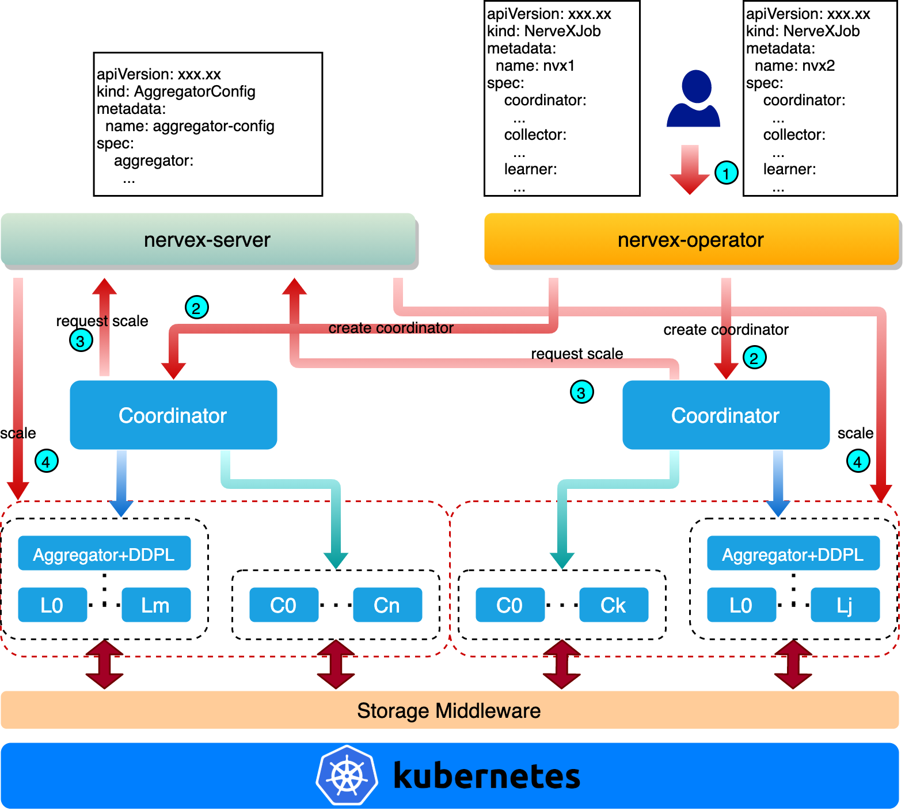

# NerveX Operator architecture
Here we will introduce the architecture of `nervex-operator`, explaining how nerveX's modules are created on Kubernetes (K8s), how to implement service discovery, how to start training, etc. For the introduction of nerveX, please refer to [nerveX key concepts](https://gitlab.bj.sensetime.com/open-XLab/cell/nerveX/tree/doc/one-week/nervex/docs/source/key_concept). The architecture of `nervex-operator` is shown in the figure below:



There are two main modules that is `nervex-server` and `nervex-operator`. In the following pages, we will first introduce how `nervex-operator` creates and starts each module of nerveX after a nerveX job is submitted to K8s, and then introduces the architecture of nervex-server and `nervex-operator`.

## Job creation process
Here is a description of the job creation process, illustrating the entire life cycle of a nerveX job from creation to execution in K8s.
- Edit the AggregatorConfig yaml file to define the aggregator template, which will be used to create aggregators when NerveXJob is created later. Aggregator can provide data parallel training services.
- Edit the NerveXJob yaml file to define the template of coordinator, collector and learner, and submit it to K8s.
- After nervex-operator received the event of NerveXJob submission, it creates a coordinator, and creates an accessible domain name for the coordinator.
- After the coordinator started, it sends an HTTP request to nervex-server to create a certain number of collectors and learners according to the coordinator's default configuration.
- After nervex-server receives the coordinator's creation request, it reads the collector and learner templates from NerveXJob object, and creates the corresponding number of collectors (Cn in the above figure) and learners (Lm in the above figure), and returns the URLs accessible to the collectors and learners. At the same time, nervex-server will determine whether to create an aggregator for each learner according to the number of GPUs applied for in each learner. That is, when the number of GPUs requested by the learner is greater than 1, an aggregator is created for the learner, otherwise no aggregator is created.
- Coordinator waits for collectors and learners (an aggregator and its multiple ddp learners are regarded as a logic learner) to connect, and then starts to issue tasks to start training.
- We can manually send a request to nervex-server to add/delete collectors or learners, and the coordinator will periodically query the number of available collectors and learners and decide to create or disconnect connections to them.
- When the training is completed, nervex-operator will delete all collectors, learners by default, while coordinator will be reserved for users to view logs and other operations.

## NerveX Operator
Nervex-operator is a component responsible for orchestrating NerveXJob in K8s. It uses K8s [operator pattern](https://kubernetes.io/docs/concepts/extend-kubernetes/operator/) to monitor the status of NerveXJob objects in K8s cluster through the control loop in [controller pattern](https://kubernetes.io/docs/concepts/architecture/controller/), and to update the status of NerveXJob when necessary. The status is modified so that the actual status of NerveXJob is as consistent as possible with our predefined status.

### API definition
The nerveX framework consists of 3 important modules, namely coordinator, collector and learner (aggregator is treated as a logic learner). According to the characteristics of each module, we have defined two Custom Resources, namely NerveXJob and AggregatorConfig. The former is used to define the prerequisites for coordinator, collector and learner to start running, including docker images, startup commands, computing and storage resources, environment variables, etc. The latter is used to define the prerequisites for aggregator.

NerveXJob definition is described as below:
```go
type NerveXJobSpec struct {
	// Group is a collection of NerveXJobs
	Group string `json:"group,omitempty"`

	//Priority labels the priority of NerveXJob
	PriorityClassName PriorityClassName `json:"priorityClassName,omitempty"`

	// CleanPodPolicy defines the policy to clean pods after NerveXJob completed
	CleanPodPolicy CleanPodPolicy `json:"cleanPodPolicy,omitempty"`

	// Volumes defines the shared volumes for nerveX components
	Volumes []corev1.Volume `json:"volumes,omitempty"`

	Coordinator CoordinatorSpec `json:"coordinator"`

	Collector CollectorSpec `json:"collector,"`

	Learner LearnerSpec `json:"learner,"`
}
```

AggregatorConfig definition is described as below:
```go
type AggregatorConfigSpec struct {
	Aggregator AggregatorSpec `json:"aggregator,"`
}
```

> **Why should aggregator be defined alone?**
    Aggregator is common module for all RL training jobs using nerveX framework, so we define the aggregator as a global and shared resource named AggregatorConfig. After RL jobs are submitted, nervex-operator will read the global AggregatorConfig in K8s cluster to create aggregators for these RL jobs. In addition, aggregator is only for most common data parallel training. You need to define a new Custom Resource if other parallel training methods are used.
### Status definition
After NerveXJob is submitted, nervex-operator takes over the management of the life cycle of the NerveXJob. In order to facilitate the user to have a better view of the NerveXJob's status, we define the following phases:

```go
const (
	// JobCreated means the job has been submitted to the cluster,
	// but not all the pods and services have been created,
	// or no pods are running
	JobCreated Phase = "Created"

	// JobRunning means all the pods are in running state
	JobRunning Phase = "Running"

	// JobSucceeded means job completed without error
	JobSucceeded Phase = "Succeeded"

	// JobFailed means some pods failed, job is also considered failed
	JobFailed Phase = "Failed"

	// JobUnknown means the job is in unknown state
	JobUnknown Phase = "Unknown"
)
```
A normal NerveXJob that runs and ends successfully will go through three stages, that is Created, Running and Succeeded:
- When NerveXJob is submitted, nervex-operator will enter the Created phase after creating the coordinator.
- When the coordinator pod is in the Running phase, NerveXJob enters the Running phase.
- When the coordinator pod is in the Completed phase, NerveXJob enters the Succeeded phase.

In addition, when the coordinator pod is in the Failed phase, NerveXJob will also enter the Failed phase. The aggregators, collectors, and learners will restart immediately after failure, but they will not affect NerveXJob's phase.

Unknown phase has not been defined.

### Control loop
Built upon [kubebuilder v3](https://github.com/kubernetes-sigs/kubebuilder/releases/download/v3.0.0/kubebuilder_linux_amd64), components such as [reflectors, informers, indexers](https://github.com/kubernetes/sample-controller/blob/master/docs/controller-client-go.md) and controllers required by operator are all encapsulated in [manager](https://github.com/kubernetes-sigs/controller-runtime/blob/master/pkg/manager/manager.go) of [controller-runtime](https://github.com/kubernetes-sigs/controller-runtime). Kubebuilder only exposes a common function named `Reconcile` to us to implement reconcile logic for NerveXJob.
```go
func (r *NerveXJobReconciler) Reconcile(ctx context.Context, req ctrl.Request) (ctrl.Result, error) {
    // your reconcile logic here
    return ctrl.Result{}, nil
}
```

When NerveXJob is submitted, we firstly list pods that belong to NerveXJob in the Reconcile function and find that the coordinator has not been created. Then we read the coordinator template defined in NerveXJob and create the corresponding coordinator pod (used to run coordinator main process) and service (used for inter-pod communication), and write some environment variables into the pod, including the name of the pod, the namespace of the pod, the port which coordinator listens to, and the URL to access the coordinator.

The port occupied by each module of the nerveX framework has a default value, as shown below:

```go
DefaultCollectorPort   = 22270
DefaultLearnerPort     = 22271
DefaultAggregatorPort  = 22272
DefaultCoordinatorPort = 22273
```

After the coordinator is created, nervex-operator will monitor the status of the pod and modify the status of the NerveXJob. After NerveXJob is completed (Succeeded or Failed), nervex-operator will delete all services of the NerveXJob, and all pods that are in the Running phase of the NerveXJob by default.

### Webhook
There may be some mistakes when submitting a NerveXJob, such as spelling mistakes in NerveXJob's fields, field value miss matched with predefined, etc., resulting in potential errors when managing NerveXJob's life cycle. For the other hand, it is necessary to set default values for some fields of NerveXJob. If the default value of NerveXJob can be set before NerveXJob is submitted, and a correctness check can be performed, it will help us find problems in advance.

To achieve the above goals, we can configure webhooks in K8s. K8s webhook consists of MutatingWebhook and ValidatingWebhook. The former is used to modify the value of the K8s resource object, and the latter is used to verify the correctness of the K8s resource object.

The webhook verification is implemented in nervex-operator. MutatingWebhook is created to set the default value for NerveXJob; ValidatingWebhook is created to verify the correctness of NerveXJob. For example, for the `CleanPodPolicy` field in NerveXJob, we set its default value in MutatingWebhook to `Running`, which means that all running pods will be deleted after NerveXJob is completed. We verify the value of the `CleanPodPolicy` field in ValidatingWebhook, if the value set by the user is not equal to any of `None`, `ALL`, or `Running`, the NerveXJob will be rejected.

## NerveX Server
Nervex-server is an http server customized for nerveX framework, providing the apis of adding, deleting, and querying collectors, learners, and aggregators. By calling the related apis of nervex-server, nervex-server can provide NerveXJob with the ability to dynamically scale collectors and learners. The following will briefly introduce the design of nervex-server, including the local cache for storing AggregatorConfig, NerveXJob and all pods of NerveXJob; the http interface design for dynamically adding, deleting and querying collectors, learners and aggregators.

### Local cache
In order to reduce the frequency of queries between nervex-server and K8s api server, thereby reducing the burden of K8s api server, we use [client-go](https://github.com/kubernetes/client-go)'s informer mechanism to store AggregatorConfig, NerveXJob and all pods of NerveXJob in local cache, as shown in the following figure

[Schematic diagram](https://github.com/kubernetes/sample-controller/blob/master/docs/controller-client-go.md)


In the above figure, we only pay attention to the upper part. Reflector receives notifications of the existence of new resource instance through list & watch api, and puts the new resource instance into Delta Fifo queue, and informer gets the new resource instance from the Delta Fifo queue and passes it through indexer to store in local cache. The query operation can be completed by querying the local cache, reducing the number of requests to K8s api server. The query command is as following:

```go
genericInformer.Informer().GetIndexer().GetByKey(key)
```

When the resource object changes, the reflector will also receive notifications and update the local cache. In addition, the informer will also periodically synchronize the local cache with K8s api server to be consistent with the resource objects in K8s cluster.


### HTTP interface
In order to support dynamic scaling of collectors/learners for NerveXJobs, nervex-server implements some http interfaces for adding, deleting and querying collectors/learners, as shown in the following figure:


提供如下接口：

| method  |  path |  description |
|---|---|---|
| GET  | /v1alpha1/replicas  |  list all collectors and learners |
| GET  | /v1alpha1/replicas?namespace=xxx  | list all collectors and learners in namespace  |
| GET  | /v1alpha1/replicas?namespace=xxx&coordinator=xxx  | list all replicas belongs to coordinator  |
| GET  | /v1alpha1/replicas?namespace=xxx&aggregator=xxx  | get learners belongs to aggregator  |
| DELETE  | /v1alpha1/replicas  | delete some replicas. put data in request body  |
| POST  | /v1alpha1/replicas  | create replicas. put data in request body  |
| POST  | /v1alpha1/replicas/failed  | post failed replicas and request for recreation. put data in request body  |

For the request format, request parameters, request body, and return value of each interface, please refer to [http interface definition](https://gitlab.bj.sensetime.com/platform/CloudNative4AI/cluster-lifecycle/nervex-operator/issues/6)。

## Advantages of NerveX Operator
Nervex-operator provides a K8s-based container-orchestration solution for the nerveX framework in a distributed scenario. For a NerveXJob, nervex-operator is responsible for arranging the various modules of nerveX so that each module can run normally and perform training tasks. By calling nervex-server’s HTTP interface, coordinator is given the ability to add, delete, and query all its collectors, learners, aggregators and improve the dynamic allocation of nerveX framework resources. In summary, nervex-operator provides the following advantages:
1. Encapsulation. Relying on the orchestration capabilities of nervex-operator, deploying nerveX distributed RL training (including pod creation and service discovery) are transparent to us. According to the deployment requirements of the nerveX framework for distributed RL training, nervex-operator will create coordinator, and then the coordinator will request nervex-server to create other modules. Nervex-operator will record the status of the pod of each module into the status of the NerveXJob. The life cycle of NerveXJob is also maintained by nervex-operator, providing us with status of NerveXJob in different stages.
2. Ease of use. We only need to define the configuration of coordinator, collector, and learner in the yaml file of NerveXJob, and submit them to K8s cluster with one click. Nervex-operator will be responsible for deploying nerveX RL trainings and liberating us from the complex distributed RL deployments in K8s cluster.
3. Robustness. Relying on the pod restart mechanism of K8s, it ensures that pods can automatically restart in the event of an unexpected exit, and the coordinator can respond quickly and reconnect.
4. Dynamic expansion. Collectors/learners required by NerveXJob is dynamically changing, so nervex-server provides HTTP interfaces to allow us to dynamically adjust the number of collectors/learners, so that NerveXJob can adjust the ratio of collectors and learners according to its own needs to optimize throughput.
